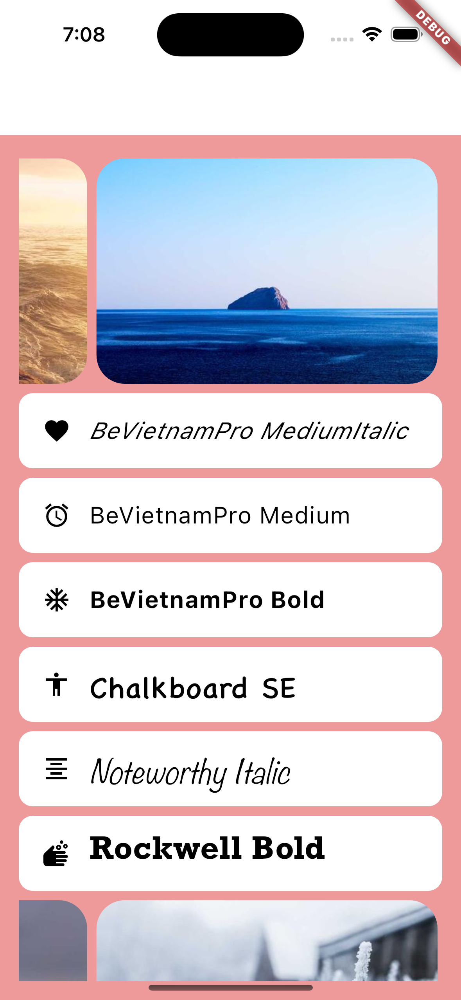

# Description

Assignment for the MAD9135 class. Explorers following areasL

- Flutter theming
- Displaying static content from the web
- Using ListView and itembuilder

## Installation and Running

- Clone the repo
- Run the command `flutter run`

## Images

